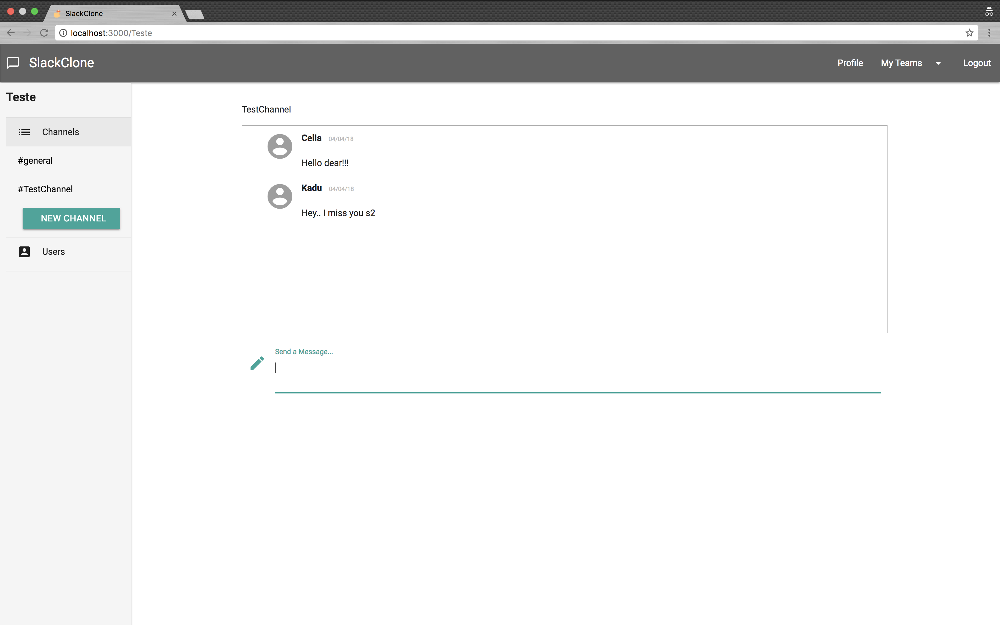

# Slack clone

Slack clone



## Installation

This app runs on a docker container. The following commands are necessary to set up the environment on your machine.

* Make sure you have docker and docker-compose installed.

* Run ```docker-compose build``` to install all gems.

* Run ```docker-compose up``` to start the application.

* The app should be available on http://localhost:3000

For production don't forget run ```docker-compose run --rm website bundle exec rake assets:precompile```

## Database

```
docker-compose run --rm website rails db:create && docker-compose run --rm website rails db:migrate
```

## Tests

The rspec gem are used for testing. The following command should run them.

```
docker-compose run --rm website rspec
```

